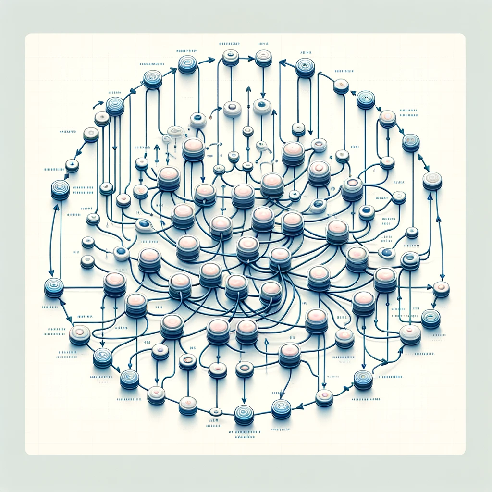

# Objetivo del proyecto.
Se parte de un DataFrame que contiene comentarios de vídeos de Youtube como datos de entrada. La salida es multietiqueta para determinar si cada comentario presenta distintos rasgos que lo convierta en un comentario de odio. Las distintas posibilidades de odio (12 en total) son las siguientes:
- IsToxic
- IsAbusive
- IsThreat
- IsProvocative
- IsObscene
- IsHatespeech
- IsRacist
- IsNationalist
- IsSexist
- IsHomophobic
- IsReligiousHate
- IsRadicalism

El proyecto tiene dos partes principales:
- **Backend**. Es la parte principal del proyecto, que es capaz de tomar cada comentario individual y determinar si es de odio o no.
- **Frontend**. Es una máscara de visualización realizada con Streamlit y otras técnicas, para presentar el proyecto como una web.

En este archivo ReadMe vamos a comentar cual la solución adoptada, y las circunstancias que nos han llevado a adoptar las soluciones descritas.

# Conflictos encontrados.
- **Idioma de los comentarios**. Los comentarios del DataFrame original están en inglés. Por esta razón se ha decidido traducir nuevos comentarios a este idioma. Para lograr esto se ha recurrido a HugginFace ([https://huggingface.co](https://huggingface.co)).

- **Dimensionalidad**. En el DataFrame original contamos sólo con 1000 filas. Evaluar un DataFrame con una cantidad tan recducida de datos es, practicamente, una tarea imposible.
- **Salidas multietiqueta**. Como hemos comentado anteriormente, el DataFrame original cuenta con 12 columnas de salida. Esto redunda en una alta dificultad a la hora de clasificar los comentarios. Si a eso sumamos el bajo número de filas de entrada que hemos mencionado en el punto anterior, obtenemos un DF imposible de procesar adecuadamente. La solución más obvia para resover esto es reducir el número de etiquetas de salida. Para ello se ha empezado creando una nueva columna binaria llamada ***isHate***. Esta columna valdrá **True** si una o más de las columnas de salida vale(n) **True**, o **False** en caso contrario. De este modo, ***IsHate*** se convierte en una "columna resumen" de las doce columnas iniciales de salida. Posteriormente, las mencionadas doce columnas se eliminan, y nos quedamos, únicamente, con la columna resumen.

- **Estructura de los comentarios**. Los comentarios están escritos en lenguage natural. Para hacerlos procesables por un modelo de ML es necesario, al menos, resolver tres cuestiones:
	- Eliminación de las Stop Words. Son palabras de uso muy común, como artículos o preposiciones, que no aportan nada al sentido del comentario, y pueden confundir al modelo empleado. Se eliminan usando un objeto NLP creado a parttir de un diccionario en inglés.
	- Eliminación de la puntuación. Los signos de puntuación, al igual que las Stop Words, no aportan nada a la columna de entrada, y pueden confundir al modelo. Python cuenta con funciones específicas para eliminar estos signos.

# Proceso.
Partimos de un DataFrame con los comentarios y las diferentes salidas.

El proceso se desarrola de la siguiente forma:
- Se eliminan las Stop Words y la puntuación de la columna de entrada.
- Se reducen las columnas de salida a una columna resumen.
- Se tokenizan los comentarios de la columna de entrada.
- Se separan las filas del DataFrame en un conjunto de entrenamiento y uno de test. El conjunto de entrenammiento tendrá el 80% por ciento de las filas (800) y el de test el 20% restante (200).
- Se procesan los comentarios mediante una Red Neuronal Recurrente (RNN).

# Resultados.

Se obtienen las siguiente métricas:
- Preisión: 95.78%.
- Recall: 98.9%.
- Train Accuracy: 92%.
- Test Accuracy: 87.5%.
- Overfitting: 4.5%.

# FRONTEND.
El frontend es una interfaz gráfica para acceder a las funcionalidades del proyecto. Para hacerlo fácil de ha realizado con Streamlit.

El front permite localizar los comentarios de un vídeo, seleccionar un comentario y hacer una traducción de los comentarios desde la mayoría de los idiomas al inglés.

La operativa del frontend está basada en la clase Vectorizer.

